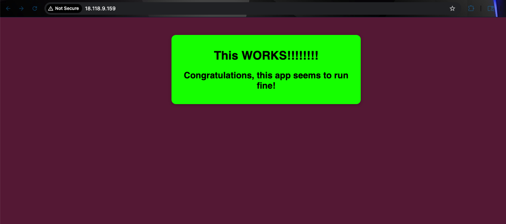

# Deployment 3

A Docker Server on ECS

============================

## About

This time around things will run through elastic container service.
As such, there will be way less commands.

============================

## Simple Steps

Here are a some simple steps as to what we will do & and where you do it before I go into more detail.

1. Run Docker Desktop - Host Machine
2. Create Repository - Amazon ECR
3. Push Image - Host Machine/Amazon ECR
4. Task Definition - Amazon ECS
5. Create Cluster - Amazon ECS
6. Deploy Container - Task Definition
7. Success! Public IP - Task Definition

============================

## Run Docker Desktop

You need the Docker engine running to build the image and push it to Amazon ECR

============================

## Create the repository

Search for ECR in AWS console and create a repository.
Private or Public will work but Private will be best for security.

Once there find the button that says "create repository" and click it.

Name your repo. Mine will be called "deployment-3/docker-2"
Then you can click create.

Once created you should see your repository on the repositories list.

## Push Image

Click on your repository and you will find a button that says "view push commands".
Click that button for a list of commands you can use to push the image.
Use those commands to push the image. They should look something like this:

=====

Retrieve an authentication token and authenticate your Docker client to your registry. Use the AWS CLI:

    aws ecr get-login-password --region us-east-2 | docker login --username AWS --password-xxzxx 000011220000.dkr.ecr.us-east-2.amazonaws.com

Build your Docker image

    docker build -t deployment-3/docker-2 .

Tag your image

    docker tag deployment-3/docker-2:latest 000011220000.dkr.ecr.us-east-2.amazonaws.com/deployment-3/docker-2:latest

Push this image

    docker push 000011220000.dkr.ecr.us-east-2.amazonaws.com/deployment-3/docker-2:latest

If copied directly from amazon you will have precise commands specific to your container.

============================

## Task Definition

Search ECS for Amazon Elastic Container Service.

Create a new task definition.

Give it a family name.
    I'm calling mine "deployment-3-web-server"

Under "Container -1" Name the container I'm calling mine "deployer"

Under this you can select your image URI which is needed to run the image you just pushed. Select it. Make sure to click the button that says "select image digest" to fully confirm your selection.

Click Create

============================

## Create Cluster

Under Amazon Elastic Container Service, Create cluster.

It will come with a default name, you can leave or change it.
Mine is called "courageous-butterfly" so I'll leave it.

Make sure AWS Fargate (serverless) is selected under Infrastructure.

Click Create

============================

## Deploy Container

Go back to Task Definitions.

Select your task definition and click deploy.
A dropdown menu should give you the option to click "Run task", click that.

Come down to the Networking section and select a security group that has port 80 exposed and click create.

Click on your new task id and await the fully provisioned status.
Here you can grab the public ip address.

Open up a browser and type your public ip with the following in front of it:

    http://

SUCCESS!!! You have built an image, created an ECR repository, pushed the image to the ECR repository, and deployed it as a container on Amazon ECS!

============================
# Teardown

you must stop the deployment before you can delete the cluster

you can deregister the task definition. After this it will "delete".
